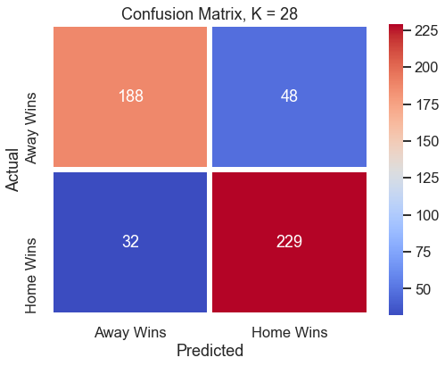
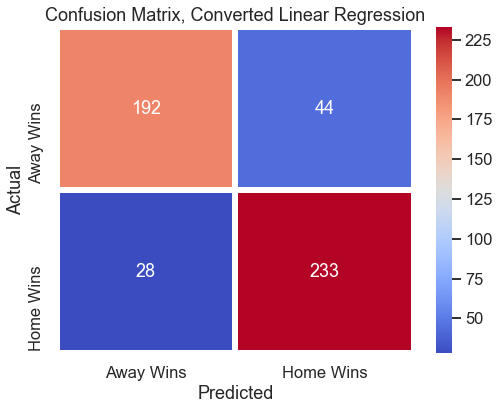
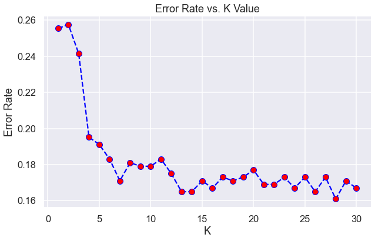

#### Predicting Game Outcomes from 2019 NBA Season
#### Date: 06/18/21
#### Team: Bryce Randolph, Jeannie Davis, Harsandeep Singh, Kevin Robell
#### Project Link: https://github.com/apainintheneck/nba-data-science/
#### Video Link:
---
### Introduction
Our group wanted to try and find out how well we could predict the outcome of NBA games. We decided to use [a NBA games dataset](https://www.kaggle.com/nathanlauga/nba-games) that we found on [Kaggle](https://www.kaggle.com) which contains all the information including statistics, teams, and dates from 2004-2020. The hope is that we can create a reasonably accurate model and look at the effectiveness of different in-game counting stats to predict the winner.

### Selection of Data
Our dataset is focused on the 2019 season from this dataset of NBA games found in the games.csv file. We are choosing to make the program modular enough that other seasons can also be analyzed, but only a single season is chosen at a time to stay within the goals of the project and avoid having to deal with time series. We’ve chosen to focus on the 2019 season because it is the most recent full season included in the dataset. We first dropped all irrelevant predictors including GAME_DATE_EST, GAME_STATUS_TEXT, HOME_TEAM_ID, VISITOR_TEAM_ID, SEASON, TEAM_ID_home, PTS_home, PTS_away and TEAM_ID_away. We made sure to remove the points scored for both teams because that information would make the outcome of the game obvious. Instead, we will focus on the in-game counting stats from each game which includes rebounds, field goal percentage, and assists. The thing we will be trying to predict will be the winner of the game as represented by the target HOME_TEAM_WINS. This is a binary column where 1 means the home team won and 0 means they lost.

### Methods
The machine learning methods we tested out were KNN classification and linear regression. As we predicted the KNN classification initially ended up giving us better results in early testing so we decided to stick with that method for a while. However, with more tweaking to the code, we found that linear regression was slightly better. Our final choice of machine learning method after much testing was linear regression.
- Numpy, Pandas, Matplotlib, and Seaborn for data analysis and visualization
- Scikit-learn for inference
- Github and Google Drive for group collaboration and version control
#### The Models
- KNN Classification: We tested the k values from 1-30 to find the value that gave us the lowest error rate.
- Linear Regression: We tried to predict the home team's point differential and that prediction then was converted into win/loss predictions.

### Results
We were able to get the error rate quite low(>less than 17%) and ended up with an accuracy rate of more than 80% in predicting the winner of a given NBA game. So we met our initial goal by having a reliable and accurate prediction. We did this using the stats of a game that had already occurred, so we won’t be making big money on sports betting anytime soon, but the proof of concept is there. The results are shown in the following confusion matrices.  
#### KNN Classification Results   

#### Linear Regression Results   

### Discussion
We found that it was best to use a K value of at least 28 using the elbow method as it produced the lowest error rate in our testing. We initially thought that the KNN classification would be the best method to use, but later switched to linear regression after comparing a few confusion matrices. We also did some digging online, specifically on Github, and found that several others have attempted a similar project with worse results. We believe the nature of how we used the data, specifically using one game's data at a time, rather than averaging season stats and comparing them, is what led to the high degree of accuracy in our project.

### Summary
This NBA game winner prediction project was a success in our eyes, as we accomplished what we initially set out to do. Using predictors like rebounds, field goal percentage, and assists, we used linear regression and knn classification as supervised methods of machine learning to determine the winner of a given NBA game using the included dataset. We believe that with more tuning and tinkering, we could make the error rate lower over time. That tuning would involve working to eliminate predictors that don't improve the accuracy of the models and including polynomial features.

### References
- Dataset: https://www.kaggle.com/nathanlauga/nba-games
